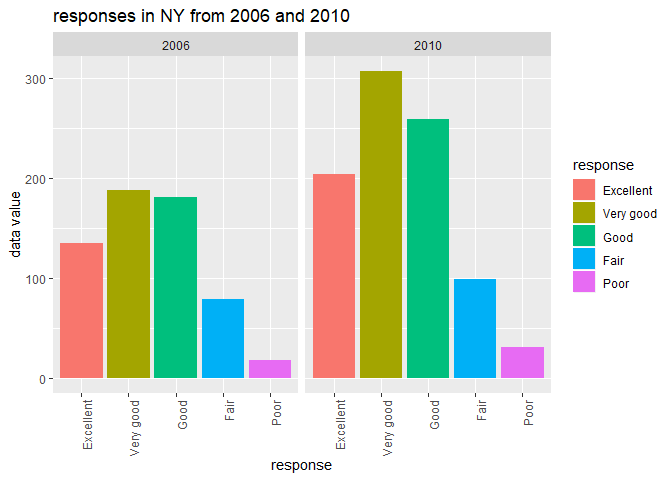

p8105\_hw 3\_ilz2105
================
Lulu Zhang
10/8/2019

|               |
| ------------- |
| **Problem 1** |

``` r
library(tidyr)
library(tidyverse)
library(dplyr)
library(ggplot2)
library(readr)
```

``` r
# load the data
library(p8105.datasets)
data("instacart") 
instacart 
```

    ## # A tibble: 1,384,617 x 15
    ##    order_id product_id add_to_cart_ord~ reordered user_id eval_set
    ##       <int>      <int>            <int>     <int>   <int> <chr>   
    ##  1        1      49302                1         1  112108 train   
    ##  2        1      11109                2         1  112108 train   
    ##  3        1      10246                3         0  112108 train   
    ##  4        1      49683                4         0  112108 train   
    ##  5        1      43633                5         1  112108 train   
    ##  6        1      13176                6         0  112108 train   
    ##  7        1      47209                7         0  112108 train   
    ##  8        1      22035                8         1  112108 train   
    ##  9       36      39612                1         0   79431 train   
    ## 10       36      19660                2         1   79431 train   
    ## # ... with 1,384,607 more rows, and 9 more variables: order_number <int>,
    ## #   order_dow <int>, order_hour_of_day <int>,
    ## #   days_since_prior_order <int>, product_name <chr>, aisle_id <int>,
    ## #   department_id <int>, aisle <chr>, department <chr>

There are 15 columns and `rnrow(instacart)` rows in the `instacart`
dataset. Som key variables are `product_name`, `aisle`, `department` and
`aisle_id`. The data also tells us what hour in the day the order was
made with the `order_hour_of_day` column and we can find out what day of
the week the order was made from the `order_dow` column. The average
time of day for orders is 13.5775922 or about 1:30pm. We can see that
`Bulgarian Yogurt` is located in aisle 120 in the `dairy eggs`
department.

``` r
#How many aisles are there, and which aisles are the most items ordered from?
 instacart %>% 
  count(aisle) %>% 
  arrange(desc(n))
```

    ## # A tibble: 134 x 2
    ##    aisle                              n
    ##    <chr>                          <int>
    ##  1 fresh vegetables              150609
    ##  2 fresh fruits                  150473
    ##  3 packaged vegetables fruits     78493
    ##  4 yogurt                         55240
    ##  5 packaged cheese                41699
    ##  6 water seltzer sparkling water  36617
    ##  7 milk                           32644
    ##  8 chips pretzels                 31269
    ##  9 soy lactosefree                26240
    ## 10 bread                          23635
    ## # ... with 124 more rows

There are aisles; `fresh vegetables` and `fresh fruits` are two of the
most ordered from aisles.

Below I made a plot that shows the number of items ordered in each
aisle, limiting this to aisles with more than 10000 items ordered.

``` r
plot1 = instacart %>%
   count(aisle) %>% 
  arrange(desc(n)) %>% 
  filter(n > 10000) %>% 
           ggplot(aes(x = reorder(aisle, -n), y = n)) +
           geom_bar(stat = "identity") +
  theme(axis.text.x = element_text(angle = 90,  hjust = 1)) +
   labs(title = "number of items ordered in each aisle")
plot1
```

<!-- -->

Next I made a table showing the three most popular items in each of the
aisles “baking ingredients”, “dog food care”, and “packaged vegetables
fruits”. I included the number of times each item was ordered.

``` r
#make a plot 
instacart %>% 
  group_by(product_name, aisle) %>% 
  summarize(frequency = n()) %>% 
  group_by(aisle) %>% 
  filter(
    aisle %in% c("baking ingredients", "dog food care", "packaged vegetables fruits"),
    min_rank(desc(frequency)) <= 3 ) %>% 
    arrange(frequency, aisle) %>% 
      knitr::kable(format = 'pandoc', caption = "Popular Aisle Items")
```

| product\_name                                 | aisle                      | frequency |
| :-------------------------------------------- | :------------------------- | --------: |
| Small Dog Biscuits                            | dog food care              |        26 |
| Organix Chicken & Brown Rice Recipe           | dog food care              |        28 |
| Snack Sticks Chicken & Rice Recipe Dog Treats | dog food care              |        30 |
| Cane Sugar                                    | baking ingredients         |       336 |
| Pure Baking Soda                              | baking ingredients         |       387 |
| Light Brown Sugar                             | baking ingredients         |       499 |
| Organic Blueberries                           | packaged vegetables fruits |      4966 |
| Organic Raspberries                           | packaged vegetables fruits |      5546 |
| Organic Baby Spinach                          | packaged vegetables fruits |      9784 |

Popular Aisle Items

Below I made a table showing the mean hour of the day at which Pink Lady
Apples and Coffee Ice Cream are ordered on each day of the week.

``` r
#make a table
instacart %>% 
  select(product_name, order_hour_of_day, order_dow) %>% 
filter(
  product_name %in% c("Pink Lady Apples", "Coffee Ice Cream")) %>% 
    group_by(product_name, order_dow) %>% 
  summarize(mean_hour = mean(order_hour_of_day)) %>% 
    mutate(
      day = recode(order_dow, 
             `0` = "Sunday",
             `1` = "Monday",
             `2` = "Tuesday",
             `3` = "Wednesday",
             `4` = "Thursday",
             `5` = "Friday",
             `6` = "Saturday"
             )) %>% 
  select(product_name, mean_hour, day) %>% 
  pivot_wider(
    names_from = "day",
    values_from = "mean_hour") %>% 
  knitr::kable(format = 'pandoc', main = "mean hour")
```

| product\_name    |   Sunday |   Monday |  Tuesday | Wednesday | Thursday |   Friday | Saturday |
| :--------------- | -------: | -------: | -------: | --------: | -------: | -------: | -------: |
| Coffee Ice Cream | 13.77419 | 14.31579 | 15.38095 |  15.31818 | 15.21739 | 12.26316 | 13.83333 |
| Pink Lady Apples | 13.44118 | 11.36000 | 11.70213 |  14.25000 | 11.55172 | 12.78431 | 11.93750 |

|               |
| ------------- |
| **Problem 2** |

First, I did some data cleaning:

format the data to use appropriate variable names; focus on the “Overall
Health” topic include only responses from “Excellent” to “Poor” organize
responses as a factor taking levels ordered from “Poor” to “Excellent”

``` r
library(p8105.datasets)
data("brfss_smart2010")

#tidy the data
brfss = brfss_smart2010 %>% 
  janitor::clean_names() %>% 
  filter(topic == "Overall Health") %>% 
  drop_na(response) %>% 
  mutate(
    response = as.factor(response),
    response = factor(response, levels =  c("Excellent", "Very good", "Good", "Fair", "Poor"))
  ) %>% 
  select(-data_value_footnote, -location_id, -data_value_footnote_symbol) %>% 
  rename(state = locationabbr,
         county = locationdesc)
brfss 
```

    ## # A tibble: 10,625 x 20
    ##     year state county class topic question response sample_size data_value
    ##    <int> <chr> <chr>  <chr> <chr> <chr>    <fct>          <int>      <dbl>
    ##  1  2010 AL    AL - ~ Heal~ Over~ How is ~ Excelle~          94       18.9
    ##  2  2010 AL    AL - ~ Heal~ Over~ How is ~ Very go~         148       30  
    ##  3  2010 AL    AL - ~ Heal~ Over~ How is ~ Good             208       33.1
    ##  4  2010 AL    AL - ~ Heal~ Over~ How is ~ Fair             107       12.5
    ##  5  2010 AL    AL - ~ Heal~ Over~ How is ~ Poor              45        5.5
    ##  6  2010 AL    AL - ~ Heal~ Over~ How is ~ Excelle~          91       15.6
    ##  7  2010 AL    AL - ~ Heal~ Over~ How is ~ Very go~         177       31.3
    ##  8  2010 AL    AL - ~ Heal~ Over~ How is ~ Good             224       31.2
    ##  9  2010 AL    AL - ~ Heal~ Over~ How is ~ Fair             120       15.5
    ## 10  2010 AL    AL - ~ Heal~ Over~ How is ~ Poor              66        6.4
    ## # ... with 10,615 more rows, and 11 more variables:
    ## #   confidence_limit_low <dbl>, confidence_limit_high <dbl>,
    ## #   display_order <int>, data_value_unit <chr>, data_value_type <chr>,
    ## #   data_source <chr>, class_id <chr>, topic_id <chr>, question_id <chr>,
    ## #   respid <chr>, geo_location <chr>

``` r
# year 2002
distinctlocation_2002 = brfss %>% 
  filter(year == "2002") %>%
  distinct(state, county) %>% 
  count(state) %>% 
  filter(n >= 7) %>% 
  rename(locations = n)
distinctlocation_2002
```

    ## # A tibble: 6 x 2
    ##   state locations
    ##   <chr>     <int>
    ## 1 CT            7
    ## 2 FL            7
    ## 3 MA            8
    ## 4 NC            7
    ## 5 NJ            8
    ## 6 PA           10

``` r
# year 2010
distinctlocation_2010 = brfss %>% 
  filter(year == "2010") %>%
  distinct(state, county) %>% 
  count(state) %>% 
  filter(n >= 7) %>% 
  rename(locations = n)
distinctlocation_2010
```

    ## # A tibble: 14 x 2
    ##    state locations
    ##    <chr>     <int>
    ##  1 CA           12
    ##  2 CO            7
    ##  3 FL           41
    ##  4 MA            9
    ##  5 MD           12
    ##  6 NC           12
    ##  7 NE           10
    ##  8 NJ           19
    ##  9 NY            9
    ## 10 OH            8
    ## 11 PA            7
    ## 12 SC            7
    ## 13 TX           16
    ## 14 WA           10

In 2002, CT, FL, MA, NC, NJ, PA were observed at 7+ locations. In 2010
CA, CO, FL, MA, MD, NC, NE, NJ, NY, OH, PA, SC, TC, WA were observed at
7+ locations.

Next. I constructed a dataset that is limited to Excellent responses,
and contains, year, state, and a variable that averages the data\_value
across locations within a state. Then I made a “spaghetti” plot of this
average value over time within a state

``` r
# make a spaghetti plot
excellent = brfss %>% 
  filter(response == "Excellent") %>% 
  group_by(year, state) %>%
  summarize(
  average = mean(data_value)) %>% 
  ggplot(aes(x = year, y = average, group = state)) +
  geom_line(aes(color = state)) +
  labs(title = "Excellent responses over state")

excellent
```

    ## Warning: Removed 3 rows containing missing values (geom_path).

<!-- -->

Then I made a two-panel plot showing, for the years 2006, and 2010,
distribution of data\_value for responses (“Poor” to “Excellent”) among
locations in NY State.

``` r
#make a two-panel plot
year_2006_2010 = brfss %>% 
filter(
  year %in% c( "2006","2010"), state == "NY") %>% 
  #filter(state == "NY") %>% 
ggplot(aes(x = response, y = data_value, group = response)) +
  geom_boxplot(aes(color = response))+
  facet_grid(~year)+
  labs(title = "responses in NY from 2006 and 2010")
year_2006_2010
```

<!-- -->

|               |
| ------------- |
| **Problem 3** |

Load, tidy, and otherwise wrangle the data. Your final dataset should
include all originally observed variables and values; have useful
variable names; include a weekday vs weekend variable; and encode data
with reasonable variable classes. Describe the resulting dataset
(e.g. what variables exist, how many observations, etc).

``` r
# load data
accel = read_csv("./accel_data.csv")
```

    ## Parsed with column specification:
    ## cols(
    ##   .default = col_double(),
    ##   day = col_character()
    ## )

    ## See spec(...) for full column specifications.

``` r
accel
```

    ## # A tibble: 35 x 1,443
    ##     week day_id day   activity.1 activity.2 activity.3 activity.4
    ##    <dbl>  <dbl> <chr>      <dbl>      <dbl>      <dbl>      <dbl>
    ##  1     1      1 Frid~       88.4       82.2       64.4       70.0
    ##  2     1      2 Mond~        1          1          1          1  
    ##  3     1      3 Satu~        1          1          1          1  
    ##  4     1      4 Sund~        1          1          1          1  
    ##  5     1      5 Thur~       47.4       48.8       46.9       35.8
    ##  6     1      6 Tues~       64.8       59.5       73.7       45.7
    ##  7     1      7 Wedn~       71.1      103.        68.5       45.4
    ##  8     2      8 Frid~      675        542       1010        779  
    ##  9     2      9 Mond~      291        335        393        335  
    ## 10     2     10 Satu~       64         11          1          1  
    ## # ... with 25 more rows, and 1,436 more variables: activity.5 <dbl>,
    ## #   activity.6 <dbl>, activity.7 <dbl>, activity.8 <dbl>,
    ## #   activity.9 <dbl>, activity.10 <dbl>, activity.11 <dbl>,
    ## #   activity.12 <dbl>, activity.13 <dbl>, activity.14 <dbl>,
    ## #   activity.15 <dbl>, activity.16 <dbl>, activity.17 <dbl>,
    ## #   activity.18 <dbl>, activity.19 <dbl>, activity.20 <dbl>,
    ## #   activity.21 <dbl>, activity.22 <dbl>, activity.23 <dbl>,
    ## #   activity.24 <dbl>, activity.25 <dbl>, activity.26 <dbl>,
    ## #   activity.27 <dbl>, activity.28 <dbl>, activity.29 <dbl>,
    ## #   activity.30 <dbl>, activity.31 <dbl>, activity.32 <dbl>,
    ## #   activity.33 <dbl>, activity.34 <dbl>, activity.35 <dbl>,
    ## #   activity.36 <dbl>, activity.37 <dbl>, activity.38 <dbl>,
    ## #   activity.39 <dbl>, activity.40 <dbl>, activity.41 <dbl>,
    ## #   activity.42 <dbl>, activity.43 <dbl>, activity.44 <dbl>,
    ## #   activity.45 <dbl>, activity.46 <dbl>, activity.47 <dbl>,
    ## #   activity.48 <dbl>, activity.49 <dbl>, activity.50 <dbl>,
    ## #   activity.51 <dbl>, activity.52 <dbl>, activity.53 <dbl>,
    ## #   activity.54 <dbl>, activity.55 <dbl>, activity.56 <dbl>,
    ## #   activity.57 <dbl>, activity.58 <dbl>, activity.59 <dbl>,
    ## #   activity.60 <dbl>, activity.61 <dbl>, activity.62 <dbl>,
    ## #   activity.63 <dbl>, activity.64 <dbl>, activity.65 <dbl>,
    ## #   activity.66 <dbl>, activity.67 <dbl>, activity.68 <dbl>,
    ## #   activity.69 <dbl>, activity.70 <dbl>, activity.71 <dbl>,
    ## #   activity.72 <dbl>, activity.73 <dbl>, activity.74 <dbl>,
    ## #   activity.75 <dbl>, activity.76 <dbl>, activity.77 <dbl>,
    ## #   activity.78 <dbl>, activity.79 <dbl>, activity.80 <dbl>,
    ## #   activity.81 <dbl>, activity.82 <dbl>, activity.83 <dbl>,
    ## #   activity.84 <dbl>, activity.85 <dbl>, activity.86 <dbl>,
    ## #   activity.87 <dbl>, activity.88 <dbl>, activity.89 <dbl>,
    ## #   activity.90 <dbl>, activity.91 <dbl>, activity.92 <dbl>,
    ## #   activity.93 <dbl>, activity.94 <dbl>, activity.95 <dbl>,
    ## #   activity.96 <dbl>, activity.97 <dbl>, activity.98 <dbl>,
    ## #   activity.99 <dbl>, activity.100 <dbl>, activity.101 <dbl>,
    ## #   activity.102 <dbl>, activity.103 <dbl>, activity.104 <dbl>, ...

``` r
#clean data
tidy_accel = accel %>% 
  janitor::clean_names() %>% 
  mutate(
    new_day = if_else(day %in% c("Monday", "Tuesday", "Wednesday", "Thursday", "Friday"), "weekday", day),
    new_day = if_else(day %in% c("Saturday", "Sunday"), "weekend", new_day)
  ) %>% 
select(week, day_id, day, new_day, activity_1:activity_1440)
  
  
tidy_accel
```

    ## # A tibble: 35 x 1,444
    ##     week day_id day   new_day activity_1 activity_2 activity_3 activity_4
    ##    <dbl>  <dbl> <chr> <chr>        <dbl>      <dbl>      <dbl>      <dbl>
    ##  1     1      1 Frid~ weekday       88.4       82.2       64.4       70.0
    ##  2     1      2 Mond~ weekday        1          1          1          1  
    ##  3     1      3 Satu~ weekend        1          1          1          1  
    ##  4     1      4 Sund~ weekend        1          1          1          1  
    ##  5     1      5 Thur~ weekday       47.4       48.8       46.9       35.8
    ##  6     1      6 Tues~ weekday       64.8       59.5       73.7       45.7
    ##  7     1      7 Wedn~ weekday       71.1      103.        68.5       45.4
    ##  8     2      8 Frid~ weekday      675        542       1010        779  
    ##  9     2      9 Mond~ weekday      291        335        393        335  
    ## 10     2     10 Satu~ weekend       64         11          1          1  
    ## # ... with 25 more rows, and 1,436 more variables: activity_5 <dbl>,
    ## #   activity_6 <dbl>, activity_7 <dbl>, activity_8 <dbl>,
    ## #   activity_9 <dbl>, activity_10 <dbl>, activity_11 <dbl>,
    ## #   activity_12 <dbl>, activity_13 <dbl>, activity_14 <dbl>,
    ## #   activity_15 <dbl>, activity_16 <dbl>, activity_17 <dbl>,
    ## #   activity_18 <dbl>, activity_19 <dbl>, activity_20 <dbl>,
    ## #   activity_21 <dbl>, activity_22 <dbl>, activity_23 <dbl>,
    ## #   activity_24 <dbl>, activity_25 <dbl>, activity_26 <dbl>,
    ## #   activity_27 <dbl>, activity_28 <dbl>, activity_29 <dbl>,
    ## #   activity_30 <dbl>, activity_31 <dbl>, activity_32 <dbl>,
    ## #   activity_33 <dbl>, activity_34 <dbl>, activity_35 <dbl>,
    ## #   activity_36 <dbl>, activity_37 <dbl>, activity_38 <dbl>,
    ## #   activity_39 <dbl>, activity_40 <dbl>, activity_41 <dbl>,
    ## #   activity_42 <dbl>, activity_43 <dbl>, activity_44 <dbl>,
    ## #   activity_45 <dbl>, activity_46 <dbl>, activity_47 <dbl>,
    ## #   activity_48 <dbl>, activity_49 <dbl>, activity_50 <dbl>,
    ## #   activity_51 <dbl>, activity_52 <dbl>, activity_53 <dbl>,
    ## #   activity_54 <dbl>, activity_55 <dbl>, activity_56 <dbl>,
    ## #   activity_57 <dbl>, activity_58 <dbl>, activity_59 <dbl>,
    ## #   activity_60 <dbl>, activity_61 <dbl>, activity_62 <dbl>,
    ## #   activity_63 <dbl>, activity_64 <dbl>, activity_65 <dbl>,
    ## #   activity_66 <dbl>, activity_67 <dbl>, activity_68 <dbl>,
    ## #   activity_69 <dbl>, activity_70 <dbl>, activity_71 <dbl>,
    ## #   activity_72 <dbl>, activity_73 <dbl>, activity_74 <dbl>,
    ## #   activity_75 <dbl>, activity_76 <dbl>, activity_77 <dbl>,
    ## #   activity_78 <dbl>, activity_79 <dbl>, activity_80 <dbl>,
    ## #   activity_81 <dbl>, activity_82 <dbl>, activity_83 <dbl>,
    ## #   activity_84 <dbl>, activity_85 <dbl>, activity_86 <dbl>,
    ## #   activity_87 <dbl>, activity_88 <dbl>, activity_89 <dbl>,
    ## #   activity_90 <dbl>, activity_91 <dbl>, activity_92 <dbl>,
    ## #   activity_93 <dbl>, activity_94 <dbl>, activity_95 <dbl>,
    ## #   activity_96 <dbl>, activity_97 <dbl>, activity_98 <dbl>,
    ## #   activity_99 <dbl>, activity_100 <dbl>, activity_101 <dbl>,
    ## #   activity_102 <dbl>, activity_103 <dbl>, activity_104 <dbl>, ...

``` r
#tidy with pivot
tidy_accel_2 = accel %>% 
  janitor::clean_names() %>% 
  pivot_longer(
    activity_1:activity_1440,
    names_to = "day_activity",
    names_prefix = "activity",
    values_to = "counts"
  ) %>%
  mutate(
    new_day = if_else(day %in% c("Monday", "Tuesday", "Wednesday", "Thursday", "Friday"), "weekday", day),
    new_day = if_else(day %in% c("Saturday", "Sunday"), "weekend", new_day),
    day_activity = as.integer(day_activity)
  )  
```

    ## Warning: NAs introduced by coercion

``` r
tidy_accel_2
```

    ## # A tibble: 50,400 x 6
    ##     week day_id day    day_activity counts new_day
    ##    <dbl>  <dbl> <chr>         <int>  <dbl> <chr>  
    ##  1     1      1 Friday           NA   88.4 weekday
    ##  2     1      1 Friday           NA   82.2 weekday
    ##  3     1      1 Friday           NA   64.4 weekday
    ##  4     1      1 Friday           NA   70.0 weekday
    ##  5     1      1 Friday           NA   75.0 weekday
    ##  6     1      1 Friday           NA   66.3 weekday
    ##  7     1      1 Friday           NA   53.8 weekday
    ##  8     1      1 Friday           NA   47.8 weekday
    ##  9     1      1 Friday           NA   55.5 weekday
    ## 10     1      1 Friday           NA   43.0 weekday
    ## # ... with 50,390 more rows

Above, I created a new variable `new_day` that tells me whether the
`day` is a `weekend` or `weekday`. I kept all of the original columns,
and did not choose to `pivot_longer` here because I wanted to be able to
read my table by `day_id`. There are 35 rows and 1444 columns in
`accel`.

Using my tidied dataset, I aggregated accross minutes to create a total
activity variable for each day, and create a table showing these totals.
Are any trends apparent?

``` r
# total activity sum for each day
tidy_accel_2 %>%
  group_by(day_id, day, new_day) %>% 
  summarize(day_activity = sum(counts)) %>% 
  select(day_id, new_day, day_activity) %>% 
  knitr::kable(format = 'pandoc', main = "total activity counts per day")
```

| day       | day\_id | new\_day | day\_activity |
| :-------- | ------: | :------- | ------------: |
| Friday    |       1 | weekday  |     480542.62 |
| Monday    |       2 | weekday  |      78828.07 |
| Saturday  |       3 | weekend  |     376254.00 |
| Sunday    |       4 | weekend  |     631105.00 |
| Thursday  |       5 | weekday  |     355923.64 |
| Tuesday   |       6 | weekday  |     307094.24 |
| Wednesday |       7 | weekday  |     340115.01 |
| Friday    |       8 | weekday  |     568839.00 |
| Monday    |       9 | weekday  |     295431.00 |
| Saturday  |      10 | weekend  |     607175.00 |
| Sunday    |      11 | weekend  |     422018.00 |
| Thursday  |      12 | weekday  |     474048.00 |
| Tuesday   |      13 | weekday  |     423245.00 |
| Wednesday |      14 | weekday  |     440962.00 |
| Friday    |      15 | weekday  |     467420.00 |
| Monday    |      16 | weekday  |     685910.00 |
| Saturday  |      17 | weekend  |     382928.00 |
| Sunday    |      18 | weekend  |     467052.00 |
| Thursday  |      19 | weekday  |     371230.00 |
| Tuesday   |      20 | weekday  |     381507.00 |
| Wednesday |      21 | weekday  |     468869.00 |
| Friday    |      22 | weekday  |     154049.00 |
| Monday    |      23 | weekday  |     409450.00 |
| Saturday  |      24 | weekend  |       1440.00 |
| Sunday    |      25 | weekend  |     260617.00 |
| Thursday  |      26 | weekday  |     340291.00 |
| Tuesday   |      27 | weekday  |     319568.00 |
| Wednesday |      28 | weekday  |     434460.00 |
| Friday    |      29 | weekday  |     620860.00 |
| Monday    |      30 | weekday  |     389080.00 |
| Saturday  |      31 | weekend  |       1440.00 |
| Sunday    |      32 | weekend  |     138421.00 |
| Thursday  |      33 | weekday  |     549658.00 |
| Tuesday   |      34 | weekday  |     367824.00 |
| Wednesday |      35 | weekday  |     445366.00 |

Activity appears to be higher on some Mondays and most weekends compared
to Tuesday-Friday. There does not appear to be any distinct trends in
the data just from looking at the values for `day_activity` and
comparing them to the `day`. The weekdays seem pretty consistent in
value for the most part, staying between 300,000 to 500,000 with some
days going lower or higher. It is difficult to tell without looking at a
plot.

Below, I made a single-panel plot that shows the 24-hour activity time
courses for each day and used color to indicate day of the week.

``` r
#plot attemp 1
activity_plot = tidy_accel %>% 
    pivot_longer(
    activity_1:activity_1440,
    names_to = "day_activity",
    values_to = "counts"
  ) %>%
  ggplot(aes(x = day_activity , y = counts, group = day_id, color = day))+
  geom_line()+
  theme(axis.text.x = element_text(angle = 90, hjust = 1, vjust = 0.5))+
  labs(title = "Activity over 24 hours ")

activity_plot
```

<!-- -->

This plot is very dificult to see anything so below I tried\* to break
up the xaxis and separate by days.

``` r
#plot  attempt 
activity_plot = tidy_accel_2 %>% 
  select(week, day, day_id, day_activity, counts) %>% 
group_by(week, day, day_id) %>% 
  ggplot(aes(x = day_activity, y = counts, group = week , color = day))+
  geom_line()+
  scale_x_continuous(
    breaks = c(0, 60, 120, 180, 240, 300, 360, 420, 480, 540, 600, 660, 720, 780, 
               840, 900, 960, 1120, 1180, 1240, 1300, 1360, 1420, 1440),
    
   labels = c("1" , "2" , "3", "4", "5", "6", "7", "8", "9", "10", "11", "12", "13",
              "14", "15", "16", "17", "18", "19", "20", "21", "22", "23", "24"),
    limits = c(0, 1440)
  ) +
  theme(axis.text.x = element_text(angle = 90, hjust = 1, vjust = 0.5))+
  labs(title = "Activity over 24 hours ")

activity_plot 
```

    ## Warning: Removed 50400 rows containing missing values (geom_path).

<!-- -->

Describe in words any patterns or conclusions you can make based on this
graph
